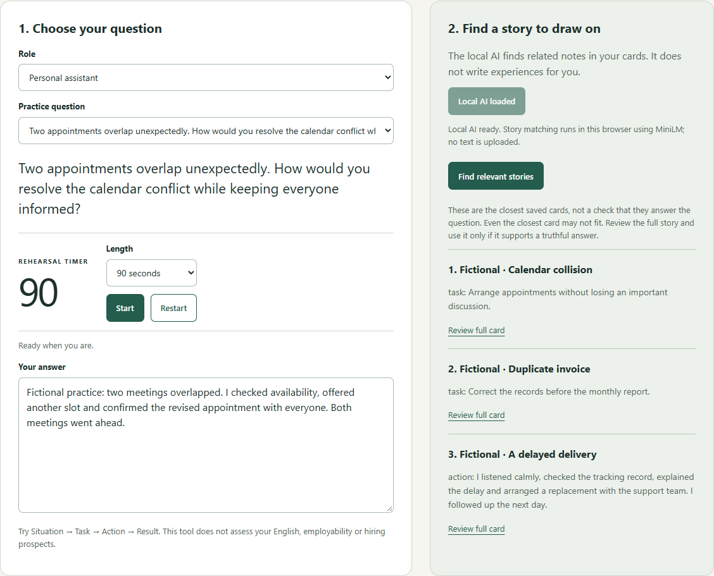
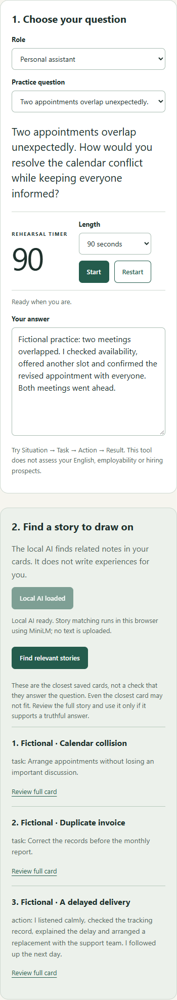

# Retrieval follow-up verification — October 4, 2026 UTC

Answer composition and timer controls now retain retrieved excerpts. Changes to the question, role or story cards clear stale matches. Request and worker ownership prevent late replies from restoring invalid results or releasing a newer request. The empty matching area offers the confirmed fictional demo, and the interface explains that the closest card may still not answer the question. Cache-clear failure now returns to manual mode with a usable download/retry control.

## Evidence

- Production build, four Node unit checks, JavaScript syntax checks and `git diff --check` passed after the final cache-recovery change.
- Nine controlled browser regression groups passed on October 4, using Chrome 154 on Windows and Node 24.15.0. These exercise answer/timer preservation, query/card invalidation, late and duplicate replies, unloaded-worker callbacks, refresh persistence, cache API failure and retry, and mobile layout. Worker replies are controlled; this run performs no model inference or download.
- The earlier production-build run recorded at `2026-10-03T23:57:44.093Z`, represented by commit `a804911a5f5f2e89673c41b45889db68927214f3`, passed 20 checks using the actual pinned MiniLM browser WASM model. It included three fictional ranking smoke cases, answer/timer preservation and offline inference after loading. Its 21 recorded page/worker requests were GET-only; neither synthetic story nor answer canary appeared in their URLs or bodies, and there were zero uncaught page errors. This actual-model suite was not rerun after the cache-recovery change.
- An independent OpenAI agent reviewed the implementation and final recovery/test changes and found no material blocker. This was a code review, not another test run.

The two screenshots below come from that earlier actual-model run. They show only the built-in fictional stories and a fictional practice answer, with an actual retrieved excerpt. Both were visually inspected; the mobile viewport is 390 pixels wide.

Generated logs, backup files and remaining captures stay excluded from Git. Reproduce with the commands in the README. No recipient study, offline-startup verification, screen-reader audit or other-browser verification is claimed. The three smoke cases do not establish general retrieval quality.

## Deployment chronology and hosted controlled checks

The source at `be7a6c49f61d7162d93a24979171d52462f3334d` was pushed first. In a later operation, the project maintainer deployed that code to the linked public demo at **2026-10-04 00:12:45 UTC**. The earlier statement that the source-publication operation did not deploy the demo referred to that operation; it did not describe the later deployment. This test/documentation follow-up changes no production application code and needs no redeployment.

The controlled-worker suite now accepts `TEST_BASE_URL`, retaining `http://127.0.0.1:4173` as its default. Fresh isolated Chrome 154 contexts on Windows, Node 24.15.0, passed the same nine groups against both targets:

| Target | Recorded UTC time | Passing groups | Page errors | Intercepted HTTP requests | Blocked infrastructure attempts | Unexpected requests |
| --- | --- | --- | --- | --- | --- | --- |
| Local production build | 2026-10-04T00:41:46.434Z | 9/9 | 0 | 6 GET | 0 | 0 |
| [Hosted demo](https://rehearsal-mirror-private-pilot.simonlevy00.chatgpt.site/) | 2026-10-04T00:42:05.026Z | 9/9 | 0 | 8 GET + 2 blocked POST attempts | 2 | 0 |

Coverage includes confirmed fictional-demo replacement; answer typing and timer start/pause/restart/duration changes retaining matches, including during pending retrieval; question/role/card edit/add/remove invalidation; stale and duplicate request ownership; replies from unloaded workers; cache API failure and retry; saved answer/question/role/duration after refresh; the closest-card caveat and 390px mobile layout without horizontal overflow.

Dedicated workers are stubbed before application code runs. Shared workers are disabled, service workers are blocked, and WebSocket connections are denied. The HTTP guard aborts external-origin requests, non-GET traffic and embedding-worker/WASM/ONNX downloads. The hosted platform attempted two same-origin Cloudflare challenge POSTs under `/cdn-cgi/challenge-platform/`; both remained blocked before transmission and were recorded separately with challenge URLs redacted. There were no external-origin requests, model downloads, socket attempts or unexpected application requests in these runs. These are observations of the isolated browser contexts, not a general statement about the platform's network behavior.

These hosted checks verify UI behavior with controlled replies. They do not verify actual hosted model loading, retrieval quality, WASM/CSP compatibility or offline inference. The earlier actual-model run and its screenshots remain separately scoped above. Raw reports remain ignored local artifacts; the repository publishes this concise summary. An independent OpenAI reviewer checked the harness and documentation before publication.

## Existing dependency advisories

The locked dependency audit reports **three affected high-severity packages**, including inherited findings; this is not three unique vulnerabilities. Dependencies were not changed or claimed fixed.

| Locked package | Affected surface and relevance to this app |
| --- | --- |
| `@huggingface/transformers` 3.8.1 | Direct dependency; its high finding is inherited from `sharp`. The production browser build selects its web export, using WASM for text embeddings. |
| `sharp` 0.34.5 | Transitive native image processing dependency. [libvips advisory](https://github.com/advisories/GHSA-f88m-g3jw-g9cj) and [libheif advisory](https://github.com/advisories/GHSA-rgj7-g3m4-5g8c) concern native image codecs. No Sharp/native codec binaries are shipped in this static browser build, and there is no Node image-processing backend. These specific codec paths are not reachable in the current browser text-retrieval flow; future Node/image use would require reassessment. |
| `vite` 7.1.7 | Development/build dependency. [Development-server WebSocket file-read advisory](https://github.com/advisories/GHSA-p9ff-h696-f583) and [Windows path advisory](https://github.com/advisories/GHSA-fx2h-pf6j-xcff) affect development-server behavior. The public artifact is static files, not a Vite server. Binding development to localhost does not by itself remove malicious-website risks. |

Dependency maintenance remains separate work: review compatible fixes and rebuild/test before upgrading. The audit does not show these advisories are exploitable through this public static app, and this surface assessment is not a comprehensive security audit.

## AI attribution

OpenAI Codex provided substantial implementation, testing and documentation assistance. Claude Sonnet 5.5 and Claude Opus 5.5, both at High effort through existing Claude subscription usage, provided development review suggestions. Those review models are not part of the app runtime. The runtime remains the open-source MiniLM embedding model described in the README. No private review transcripts, prompts or personal practice records are included here.
